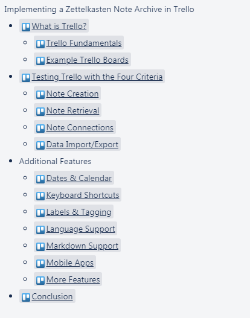
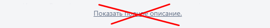
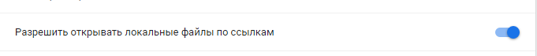

# Скрипты для подключения к страницам
🙋

## Установка
- Установить браузерный (chrome, firefox) плагин для выполнения пользовательских скриптов — [tampermonkey](https://www.tampermonkey.net/)
- Выбрать скрипт в этом репозитории, который вы хотите использовать. Посмотрите файл и нажмите кнопку «Raw» в верхней части файла, чтобы увидеть исходный код скрипта
- Скопировать исходный код скрипта
- Открыть «Tampermonkey» в вашем браузере и перейти на вкладку Add Script (значок со знаком плюс)
- Вставить исходный код в окно скрипта и нажать кнопку «Сохранить» или сочетание клавиш ctrl + s

## Скрипты
### Функционал для улучшения [Trello](https://trello.com)
1. Добавление всех карточек (не архивных) в виде оглавления.


2. Открытые карточки всегда будут развернуты


3. Увеличенный размер карточки, когда она открыта

4. Добавление всех ссылок расположенных на карточке во вложение

5. Измененный внешний вид кода в md с помощью highlight.js

## Разработка
- Нужно в [tampermonkey](https://www.tampermonkey.net/) активировать доступ к файлам

- Добавить скрипт, удалить все кроме: 
```
// ==UserScript==
…
// ==/UserScript==
```
- Добавить в `// ==UserScript==` строку:
```
// @require file:///YOU_DIRECTORY/SCRIPT_NAME.user.js
```
- Теперь меняя код в IDE, он автоматически сохраняется в плагине
